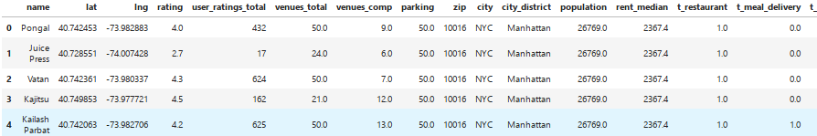
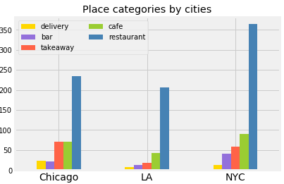
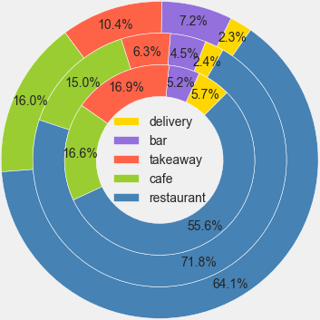
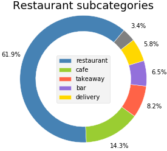
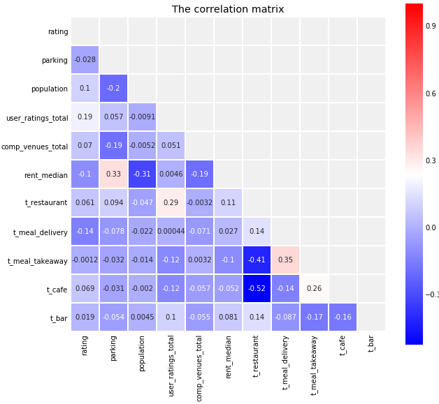
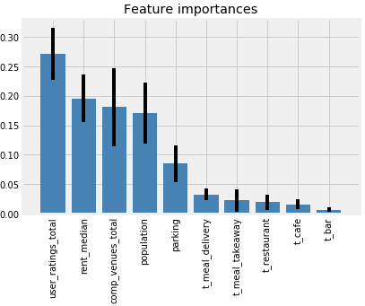
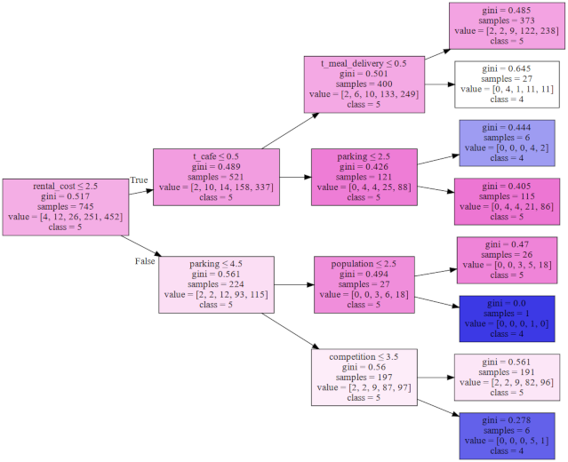
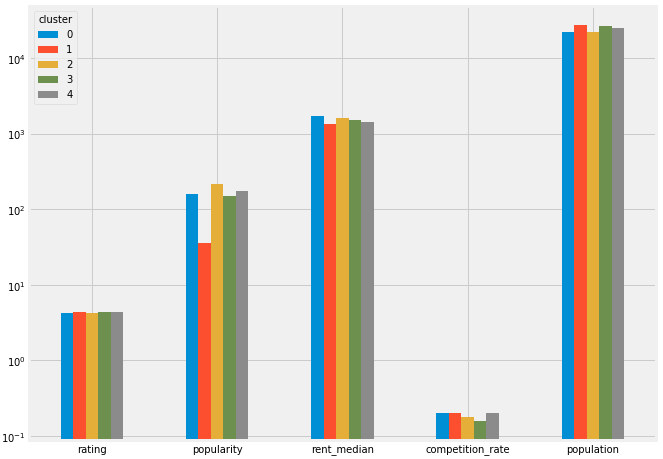
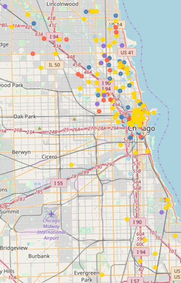

# Choosing a place for a vegetarian eatery </br>in New York, Los Angeles and Chicago
----------


## 1. Introduction

### 1.1. The Background Information

The growing popularity of vegetarianism is noticeable globally. For example, in US alone, according to the Gallup  research conducted in year 2018 [1], around 8% of Americans consider themselves vegetarians. People choose vegetarian diet for various reasons. Previously, vegetarians were more concerned about ethical issues regarding animal welfare, but the sharp increase in interest in vegetarianism have another reason. Nowadays, many new vegetarians put their personal health and the "health" of the Earth at the forefront. Thus, it is believed that people who eat less meat, especially red one, live longer and suffer less from cardiovascular diseases and even some forms of cancer. In addition, livestock has a negative impact on greenhouse gas emissions. According to a study conducted by the Oxford Martin School [2], a global switch to vegetarianism could reduce greenhouse gas emissions from food production by more than 60%.

In light of the above, the role of  places where "green-thinking" people could get full-bodied meal without meeting halfway their "green" beliefs, becomes crucial.

> [1] Snapshot: Few Americans Vegetarian or Vegan Gallup, Inc - https://news.gallup.com/poll/238328/snapshot-few-americans-vegetarian-vegan.aspx  
> [2] Peter Scarborough, Paul N. Appleby, Anja Mizdrak, Adam D. M. Briggs, Ruth C. Travis, Kathryn E. Bradbury, and Timothy J. Key. Dietary greenhouse gas emissions of meat-eaters, fish-eaters, vegetarians and vegans in the uk. Climatic Change, 125(2):179–192, Jul 2014.


## 2. The Data <a name='data' />
### 2.1. Data sources
In order to accomplish the aforementioned task the following data sources were examined and used:

1. Dataset 'US vegetarian restaurants', available from [Kaggle](https://www.kaggle.com/parkerservello/veg-restaurants)
    * This is the main data source containing quite large amount of data concerning the veg restaurants. Unfortunately, the most of the data is fragmentary and unstructured. Thus, there were taken only the `name` (of the places),  `coordinates` (latitude, longitude) and `city` (to cut out unneeded data concerning other than the three cities of interest).
2. Google databases (through *Google API* queries)
    * The API queries to Google databases were used to find out the categories of the places, their ratings and number of people who rated the place. The query strings contain the place's name and its coordinates.
3. Foursquare databases (API queries as well)
    * The Foursquare was helpful in finding the venues nearby the restaurants and finding out the share of competitors (other eateries) among them.
4. OpenStreetMap map and textual data (through *Folium* and  *Nominatim* libraries, accordingly)
    * The Nominatim libraries helped us to find out the postal codes of the places of interest and number of parking areas nearby.
    * The Folium libraries are used to acquire map data in order to visualize the received results 
5. Dataset 'Insightful & Vast USA Statistics' available from [Kaggle](https://www.kaggle.com/goldenoakresearch/us-acs-mortgage-equity-loans-rent-statistics), as well.
    * This dataset was used to acquire median rental data and population data by zip codes. 
    * Missing values were checked manually using [Mapszipcode](http://www.mapszipcode.com/california/woodland%20hills/91364/) site.
    


### 2.2. A Sample Of The Final Dataset

Here is the sample of the dataset I have got after fetching and cleaning up the data. Note: some columns are removed from the final version, e.g. `lat`, `lng`, `zip` — the ones that won't directly take part in the analysis.

<p align='center'></p>
<p align='center'><small><b>Figure 1.</b> A sample of the data table.</small></p>


#### 2.2.1. The Short Description Of The Columns

| name                 | description                                                  |
| -------------------- | ------------------------------------------------------------ |
| 'name'               | the name of the place                                        |
| 'lat'                | latitude                                                     |
| 'lng'                | longitude                                                    |
| 'rating'             | the rating of a place                                        |
| 'user_ratings_total' | the number of customers who provided the rating              |
| 'venues_total'       | the total number of venues around the place                  |
| 'venues_comp'        | the number of venues which might be competitors to the place |
| 'parking'            | number of parking areas around the place                     |
| 'zip'                | the postal code                                              |
| 'city'               | the city where the restaurant is situated                    |
| 'city_district'      | a group of neighborhoods under the same name                 |
| 'population'         | the number of inhabitants corresponding to the postal code   |
| 'rent_median'        | the median gross rent of the specified location              |
| 't_category'         | a group of columns of one-hot encoded place categories, see the table example above |

<center><b>Table 1.</b> The columns and their descriptions</center>


## 3. Methodology

### 3.1. The business understanding

**The purpose** of the work (or a **problem** to be solved) is to find out the optimal location for a vegetarian eatery in one of the three most populous US cities – New York City (NY), City of Los Angeles (CA) and Chicago (IL) by means of profiling existing approximately 900 vegetarian eateries of the these cities. The received results can be generalized to the cities sharing the same populational and sociocultural context (e.g. big cities of North America and probably Europe).  

**The stakeholders** of the result of this research would be as entrepreneurs who wish to establish their own vegetarian restaurant, as the vegetarian food lovers willing to get acquainted with the best veg restaurants.   

### 3.2. Analytic approach

The gathered data was analyzed using methods of descriptive statistics (visual data representation by different types f charts, correlation analysis) and machine learning algorithms (random forest, decision trees and hierarchical  agglomerative clustering).

### 3.3. Data collection and preparation

The data sources and its acquisition methods were described in the chapter [Data](#data). The step-by-step descriptions are available from the following files (the links lead to the ipynb viewer, the files themselves are hosted in [my GitHub repo](https://github.com/vd2/Battle_Of_Neighborhoods). Please refer to the `README` (opens on entering the repo) for the files' descriptions.

The main steps of preparation of the data were the following:

1. The file *US vegetarian restaurants* dataset from Kaggle was iteratively read to acquire only the data concerning the three cities of our interest. As soon as the major amount of the data was unnecessary due to the different reasons, including incompleteness and poor structure, the only columns were taken are `name`, `city` and coordinates. The unrepairable entries (both the name and coordinates were empty) were deleted, the names were tidied up. 

2. From the Google databases was fetched the following data:

   * 'name', 'place_id', 'geometry.location.lat', 'geometry.location.lng', 'types', 'rating',  'user_ratings_total' 
   
   The reason to reacquire the coordinates and place names was keeping the data up to date.  The column `types` containing the lists of place types (restaurant, café, bar etc.) was lately converted into separate columns,  one-hot encoding technique was applied. The `rating` column depicts the rating of the place, and the `user_ratings_total` is the number of the people gave their ratings. This value essentially (but indirectly, though) indicates the popularity of the place. 

3. The  Foursquare was used to discover the venues nearby. The final result was to find out the share (percentage) of the competing places (the venues providing food). The place categories are following:

```
   Restaurant', 'BBQ', 'Bakery', 'Coffee Shop', 'Pizza', 'Cheese', 'Steakhouse','Pub', 'Fried Chicken', 'Food Court', 'Food Stand', 'Food Truck', 'Friterie', 'Dessert', 'Bodega', 'Creperie', 'Bistro', 'Cafe', 'Café', 'Breakfast', 'Bagel', 'Buffet', 'Bubble Tea Shop', 'Diner', 'Donut', 'Gastropub', 'Salad', 'Sandwich', 'Tea Room', 'Truck Shop', 'Wings Joint'
```

True, some of the places are not vegetarian by definition (e.g. `steakhouse`, `fried chicken`, `wings joint` etc), but, in turn, the visitors of the veg places are not vegetarians and vegans only.  

4. The Nominatim libs (OpenStreetMap) was used to fetch zip codes, names of boroughs and number of parking areas nearby. The number of parking places nearby is essential for every public place, especially in the country with active car traffic. The fetched data was, as always, cleaned, checked and, if necessary, updated using other online sources (web-sites). 

5. From the Kaggle dataset *'Insightful & Vast USA Statistics'* was taken the data concerning the population number dwelling in the area with a certain zip code and median rental data related to this area.

6. It was decided to take into analysis the larger areas of the cities than boroughs and neighborhoods. As soon as the data concerning more than one city was analyzed, the resulting amount of neighborhoods would make unnecessary 'data noise'; thus, in Chicago alone there are about 80 neighborhoods! The fetching of city districts according to zip codes was accomplished separately, basically by fetching HTML code of the appropriate web pages, cleaning, structuring, filling missing values (they were just single ones) manually. The results was merged into the final data table.

7. **Additional tidying**: 

   * only the following place categories (columns) were left: `t_restaurant`, `t_meal_delivery`, `t_meal_takeaway`, `t_cafe` , `t_bar`. 
   * the normalization techniques were applied before accomplishing certain machine learning classification algorithms (random forest and agglomerative hierarchical clustering) 
   * the column `comp_vneues_total` was formed, based on the competitive venues count and the total number of venues around the place. Its categorized variant was named `competition`. The decoding of this and other variables is presented in the table below.

|                                                      columns |       1       |         2         |    3    |       4       |       5       |
| -----------------------------------------------------------: | :-----------: | :---------------: | :-----: | :-----------: | :-----------: |
|                                              user **rating** | very negative |     negative      | neutral |   positive    | very positive |
| **popularity** index  <br> <small>(based on the total number of ratings)</small> |   very low    |        low        | average |     high      |   very high   |
|                                              **competition** |   very low    |        low        | average |     high      |   very high   |
|                                           **parking**  areas |    little     | less than average | average | above average |     many      |
|                                      level of **population** |   very low    |        low        | average |     high      |   very high   |
|                                              **rental_cost** |   very low    |        low        | average |     high      |   very high   |
<center><b>Table 2.</b> The categorization of the variables</center>


### 3.4. Methods of data analysis

Beside some basic descriptive statistics methods (data visualization), the non-parametric correlation analysis was accomplished (Kendall's tau) in order to reveal possible connections between numeric variables. This method was chosen because the data was not normally distributed and the data volume is limited.

The random forest classification method was used to reveal the range of features' importances.  The decision tree classifier (preceded by grid search for parameters estimations) was applied in an attempt to find the connection between place's rating and other parameters. For the simpler interpretation, the data was categorized (see **Table 2** for details). The hierarchical agglomerative clustering was applied in order to find patterns in the data. First, the dendrogram was built:

<p align="center">
<p align="center"><small><b>Figure 2.</b> The dendrogram of vegetarian eateries of NYC, LA and Chicago.</small></p>

A significant jump in distance is typically the place to determine a certain number of clusters. In this case, I've chosen the distance value of 97, cutting off 5 clusters. The further agglomerative clustering was used utilizing the found number of clusters. 

## 4. Results

Firstly there were accomplished some descriptive statistics steps. It appeared that the most popular place category among all the cities is restaurant: 

<p align="center">
<p align="center"><small><b>Figure 3.</b> Place categories by cities.</small></p>

The following donut chart provides more distinct picture:

<p align="center">
<p align="center"><small><b>Figure 4.</b>The share of places' categories among the cities. Outer donut: NY, middle — LA, inner — Chicago.</small></p>

More than a half of vegetarian eateries are restaurants. It should be noted, though, that these numbers (percentages) are not absolute, because the categories themselves are not 'pure': a place can belong to several categories at the same time. Among all the restaurants , 27.8% of places have a hybrid nature — they are at the same time a caffe, a takeaway, a bar or a meal delivery (**Fig 5**):

<p align="center">
<p align="center"><small><b>Figure 5.</b>Restaurant subcategoris</small></p>

The non-parametric correlative analysis of all the numeric data variables gives the following results:

<p align="center">
<p align="center"><small><b>Figure 6.</b>The correlation mathrix of all the numeric vars.</small></p>

Let's observe the more or less significant correlations that are $\geqslant 0.2$ by absolute value (top down). There are obvious negative connections between the population and the number of parking areas, the rent median and the number of people living in the area (the smaller the rent the more people are living here), but this is not directly connected to the research, as well as the positive correlation between rent median and the number of parking areas. Moreover, it must always be kept in mind, that the numeric connection does not necessarily mean or lead to any connection between the entities  in 'real life', or the reason of the connection lies beyond the observed variables. Thus, although the rent median is not apparently related to the number of parking areas, but, for example, in a city's central areas, where the rent is obviously high, there are a lot of venues having parking areas nearby. As to the point of our direct interest, the rating of a place, unfortunately there are no any significant correlations, neither positive nor negative, to other variables. 

The **random forest** regressor gave the range of feature importance:

<p align="center">
<p align="center"><small><b>Figure 7.</b>The range of feature importance.</small></p>

The `user_ratings_total`, or the `popularity` in categorized form, seems to be the most important features connected to the rating of the vegetarian eatery. The second and the third by importance are the `rent median` and the level of `competition` (the share of competitive places nearby). Although the $R^2$ value is as low as 0.18. 

The decision tree classifier didn't provide somewhat significant results allowing us to make certain connection between the place's rating and other 'outer' variables:

<p align="center">
<p align="center"><small><b>Figure 8.</b>The DT classifier.</small></p>


Spoiler: the **agglomerative hierarchy clustering** won't give any insight as well. The quantitative division by clusters is following


|Cluster| Number of places   |
|------:|--------------------|
|0      |557                 |
|2      |114                 |
|1      |98                  |
|4      |93                  |
|3      |70                  |

The figure below shows the comparison of the median rates of the major variables, represented in log scale (otherwise the differences within each group except the `population` won't be seen due to variety in min-max values of each variable. As it can be seen,  despite the apparent differences in popularity (the most obvious ones), rent median, area population and competition rate (the least visible differences),  the median rating is nearly the same when uncategorized and exactly the same (very high) when categorized. 

<p align="center">
<p align="center"><small><b>Figure 9.</b>The main categories grouped by clusters.</small></p>

The source table is presented below.

| cluster | rating | popularity | rent_median | competition_rate | population |
| ------: | -----: | ---------: | ----------: | ---------------: | ---------: |
|       0 |   4.30 |      161.0 | 1705.000000 |             0.20 |    22390.0 |
|       1 |   4.40 |       35.5 | 1331.000000 |             0.20 |    27319.5 |
|       2 |   4.30 |      213.5 | 1635.666667 |             0.18 |    22390.0 |
|       3 |   4.45 |      150.0 | 1505.975000 |             0.16 |    26680.5 |
|       4 |   4.40 |      176.0 | 1455.000000 |             0.20 |    25096.0 |

The absence of any connections between places can also be see on the map data, but it can be concluded empirically as well, because the differences between areas was not studied separately and was planned to be used only as a possible auxiliary illustrative measure:

<p align="center">
<p align="center"><small><b>Figure 9.</b>The map of Chicago with the kaleidoscope of vegetarian eateries having no visible structure.</small></p>

## 5. Discussion

Despite the variety of methods applied, the results didn't show any significant connection between the rating of a veg eatery and any other external variables, such as the place popularity, rent value, competition rate and the number of people living in the area. 

By the method of elimination it might be concluded, that all comes to the 'internal' factors, without any particular order: the quality of the menu (both variety of dishes and their quality) the staff professionalism and the pleasant atmosphere. 

As to the quality of the analyzed data — in my opinion, in terms of the quantity of the places to analyze it appeared to be adequate, and barely the addition of the data from one or two major cities could change the resulting conclusions. Unfortunately, there data fetching was also limited to the free possibilities provided by certain services (Foursquare). Moreover, the ratings alone, even connected with the number of respondents, won't provide much useful information if we don't see the justification of it in the textual comment. Thus, the textual analysis of the reviews would give much more insight into the factors determining the quality of a place. 


## 6. Conclusion

Unfortunately, the present work seemed to be more useful to the author rather than the reader of the report — there were many interesting methods of analysis applied. I refer the reader to the appropriate code file hoping to provide some useful code for their own analysis. 

The author's recommendation to the subsequent researchers would be to concentrate on the places' "internal" characteristics, such as quality of menu, staff, interior and so on. In terms of taking into account users' ratings it might be recommended to analyze them along with the textual artifacts that could explain and even justify the giving rating. 


# Thanks for your attention!


